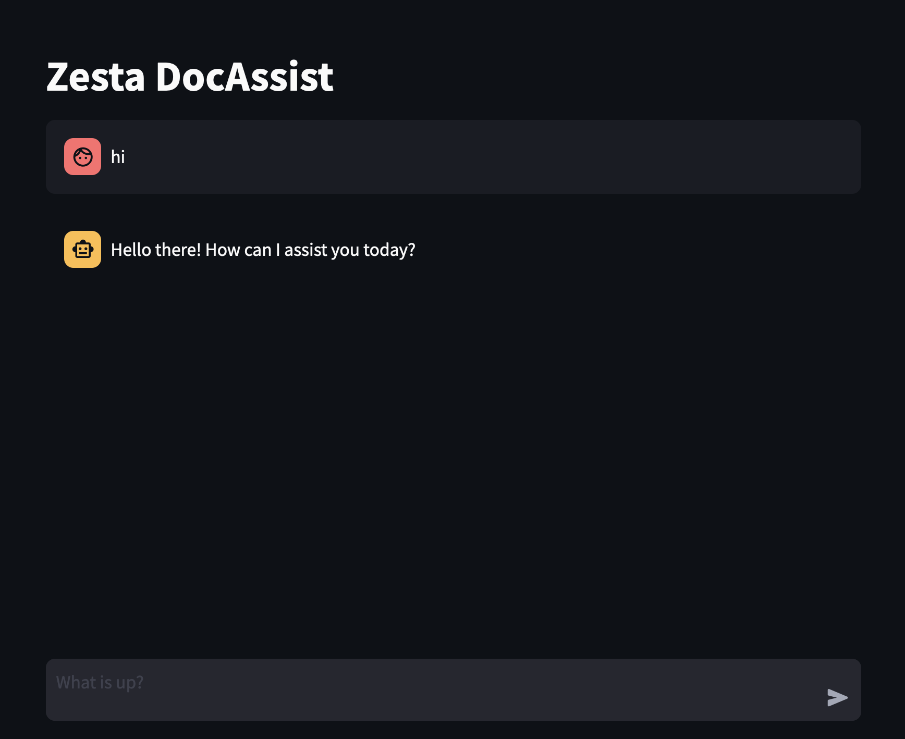

= Zesta DocAssist-LLM
:description: RAG-enhanced LLaMa-like transformer neural network based LLM for assistance on programming language/framework documentations, with a Streamlit front-end.
:source-highlighter: rouge
:icons: font
:experimental:
:diagram-enabled:

RAG-enhanced LLaMa-like transformer neural network based LLM for assistance on programming languages/frameworks' documentations, with a streamlit front-end.

Based on the paper: "_DocAssist: Large Language Models’ Brilliance in the Art of Web Development Dialogue_"

== Abstract

Accessing comprehensive and relevant documentation is crucial for developers. This project proposes a novel approach leveraging a RAG-enhanced LLaMa-like Transformer Neural Network (RAG-LLTN) to assist developers in accessing and understanding programming language and framework documentation.

The RAG-LLTN model integrates Retrieval-Augmented Generation (RAG) capabilities with the architecture of LLaMa-like Transformer Neural Networks (LLTN), enhancing its ability to retrieve and generate contextually relevant and accurate documentation assistance. RAG allows the model to retrieve relevant passages from a knowledge base, while LLTN enables efficient processing and generation of natural language text. The integration with a Streamlit front-end offers a practical solution for developers.

== Architecture

The core of DocAssist is based on a LLaMa-like transformer architecture enhanced with Retrieval-Augmented Generation (RAG).

image::assets/LLaMa-Pipeline.svg[graphviz,LLaMa-Pipeline, svg, align="center"]

=== Key Enhancements (LLaMa-like Architecture)

*   *Pre-normalization Using RMSNorm:* Employs RMSNorm for normalizing the input of each transformer sub-layer, optimizing computational cost compared to standard Layer Normalization while maintaining similar performance.
*   *SwiGLU Activation Function:* Uses the SwiGLU activation function (inspired by PaLM and extending Swish) in the feed-forward network, offering flexibility by combining smoothness and piecewise linearity.
*   *Rotary Embeddings (RoPE):* Encodes absolute positional information using a rotation matrix, naturally incorporating explicit relative position dependency in self-attention. Offers scalability and decaying inter-token dependency with distance.

=== Retrieval-Augmented Generation (RAG)

RAG integrates retrieval-based methods with generative models. It first retrieves relevant passages from a knowledge base (e.g., documentation) based on the input query and then uses a generative model to synthesize this information into a coherent response.

== Frontend

A user-friendly interface is provided using Streamlit (Python).

.Streamlit Chat Interface

== References

. Touvron H. Lavril T., Izacard G., et al. LLaMA: Open and Efficient Foundation Language Models.
. Vaswani A., Shazeer N., Parmar N., et al. Attention Is All You Need.
. Shazeer N. GLU Variants Improve Transformer.
. Zhang B., Sennrich R. Root Mean Square Layer Normalization.
