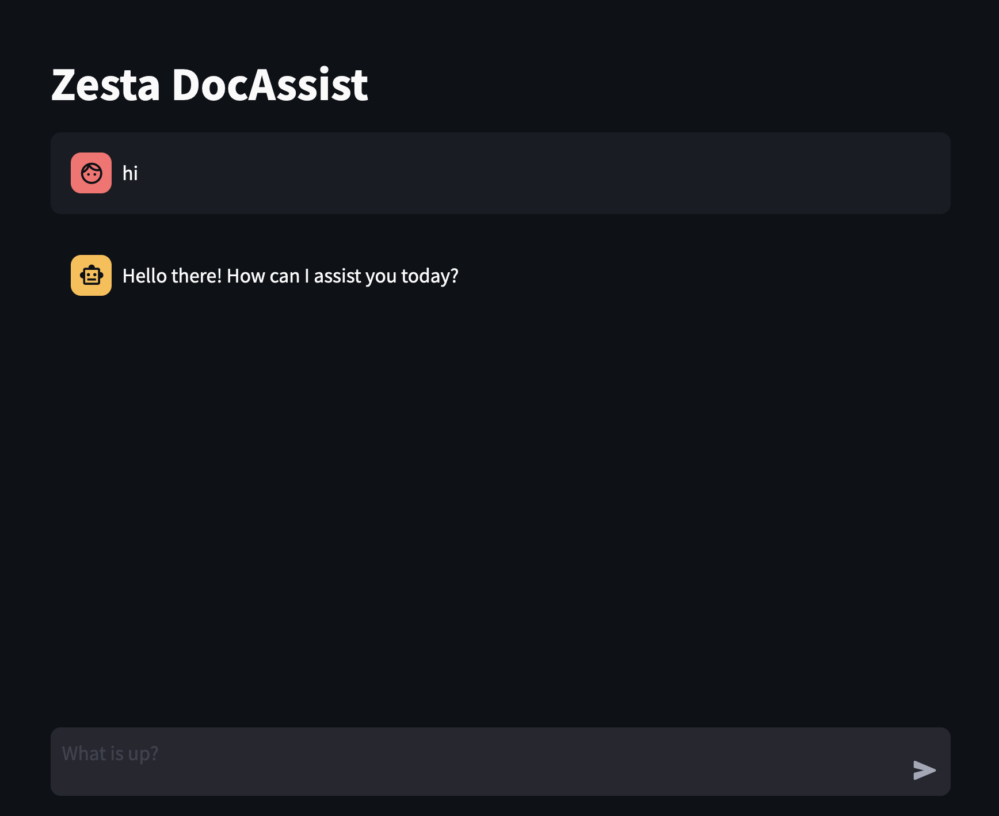

# Zesta DocAssist-LLM
RAG-enhanced LLaMa-like transformer neural network based LLM for assistance on programming lanugauges/frameworks' documentations, with a streamlit front-end.

---

### Team Members
- [Divit Mittal (Team Leader)](https://github.com/DivitMittal)
- Divyendu Sigh Bhati
- Mohd. Ramin Zaheer
- Sanchit Lamba

